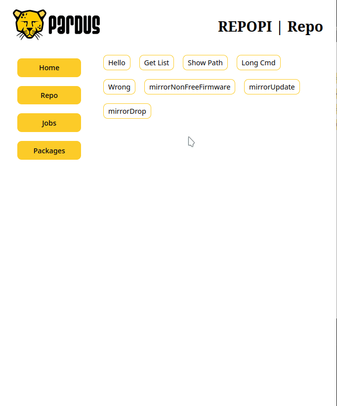

# Repository Management Tool

This will be provide functionalities for managing repositories using Aptly commands. 

### Usage
- Install APTLY.
- Install requirements.
- Start django server.

### Log File
- Logs Folder can be found inside repopi/settings.py -> DATA_FOLDER

 

 

Change the linux and mac parts on commandTool/views.py according to your OS.